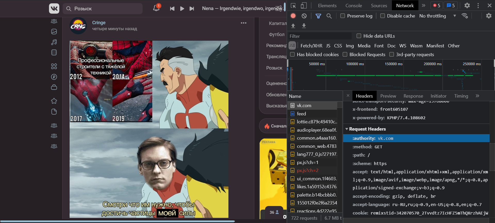
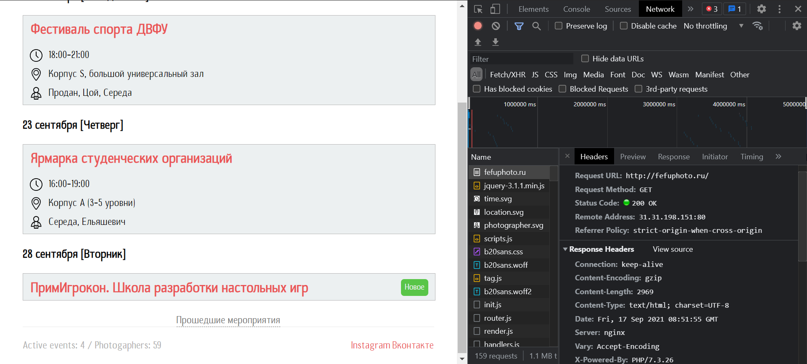

# Задача 1
**Постановка задачи:**   
> написать эссе, отражающее особенности как минимум 10 уникальных HTTP-заголовков для Request и Response.
## Введение
На паре по СИТ мы непосредственно разобрали некую структуру того, как вообще работают сети, в ходе изучения которой была затронута тема request и response. Давайте же теперь отметим заголовки присущие Request и Response с помощью консоли разработчика в браузере в различных web-ресурсах.  

---

## Основная часть

### vk.com
При переходе на сайт https://vk.com/, будучи авторизованным пользователем мы видим следующую картину:

<small>Что нам показывает сама страничка</small>

**Request Headers**  

```css
:authority: vk.com
:method: GET
:path: /
:scheme: https
accept: text/html,application/xhtml+xml,application/xml;q=0.9,image/avif,image/webp,image/apng,*/ *;q=0.8,application/signed-exchange;v=b3;q=0.9
accept-encoding: gzip, deflate, br
accept-language: ru-RU,ru;q=0.9,en-US;q=0.8,en;q=0.7
cookie: remixstid=342070570_2Tvvdtz7IcHFZ5mThQXrzhAEjWHCpJJdRS3YzzXl9Sg; remixflash=0.0.0; remixscreen_width=1280; remixscreen_height=720; remixscreen_depth=24; remixdt=25200; tmr_lvidTS=1622780619453; tmr_lvid=23d3566e7fd954db3aad38a2fe0d70b9; remixlang=777; remixuas=OTQxMDhkZTFiNmVhNzYwMGE0ZWU5MWY5; remixscreen_dpr=1.3499999046325684; remixscreen_orient=1; remixQUIC=1; remixrefkey=45219258e14e5680f0; remixua=41%7C-1%7C191%7C3893889370; remixgp=92e101dff27cf30b47450efbe2ed8456; safeframe-test-cookie_1632036915699_32_1=test; safeframe-test-cookie_1632044788922_32_1=test; safeframe-test-cookie_1632215603040_58_1=test; safeframe-test-cookie_1632215662278_13_1=test; safeframe-test-cookie_1632268845240_91_1=test; safeframe-test-cookie_1632271261162_20_1=test; safeframe-test-cookie_1632316308101_72_1=test; safeframe-test-cookie_1632453535146_55_1=test; remixsid=a471d18327a918e413f00cd45f6145aafc5ad3589726b257b04015432214c; safeframe-test-cookie_1632466089164_53_1=test; tmr_detect=0%7C1632466092768; remixscreen_winzoom=1.62; tmr_tcdhn=1632470623550; tmr_reqNum=4012; safeframe-test-cookie_1632470625344_32_1=test
sec-ch-ua: "Google Chrome";v="93", " Not;A Brand";v="99", "Chromium";v="93"
sec-ch-ua-mobile: ?0
sec-ch-ua-platform: "Windows"
sec-fetch-dest: document
sec-fetch-mode: navigate
sec-fetch-site: none
sec-fetch-user: ?1
upgrade-insecure-requests: 1
user-agent: Mozilla/5.0 (Windows NT 10.0; Win64; x64) AppleWebKit/537.36 (KHTML, like Gecko) Chrome/93.0.4577.82 Safari/537.36
```

Мы видим, что пользователь пытается по домену vk.com *(authority)* перейти по пути '/' *(path)*, выполняется метод GET *(method)*, протокол https *(scheme)*. Но интересные вещи нас ждут дальше. 

Мы можем увидеть определение языковых предпочтений клиента *(Accept-Language)*. 

Также видим с какого устройства произведён переход и какой используется браузер + какие-то параметры браузера и движок, используемый им *(sec-ch-ua-platform и sec-ch-ua)*. Так же в параметре *accept-encoding* мы видим список форматов сжатия данных, которые поддерживает клиент.  

Так как сайт нас сразу перебросил на страницу с лентой записей, то мы видим следующие заголовки:
```css
sec-fetch-dest: document
sec-fetch-mode: navigate
sec-fetch-site: none
sec-fetch-user: ?1
```

**Response Headers**
```css
access-control-expose-headers: X-Frontend
alt-svc: h3=":443"; ma=86400,h3-29=":443"; ma=86400
content-encoding: gzip
content-length: 20
content-type: text/html; charset=windows-1251
date: Fri, 24 Sep 2021 08:03:46 GMT
location: /feed
server: kittenx
set-cookie: remixir=DELETED; expires=Thu, 01 Jan 1970 00:00:01 GMT; path=/; domain=.vk.com; secure; HttpOnly; SameSite=None
set-cookie: remixir=1; path=/; domain=.vk.com; secure; HttpOnly; SameSite=None
strict-transport-security: max-age=15768000
x-frontend: front220205
x-powered-by: KPHP/7.4.108683
```
Здесь мы так же можем заметить в кодировке присутствует алгоритм сжатия, но теперь только один - gzip. Так как, нас всегда при переходе на главную страничку vk перебрасывает на ленту с постами, то тут уже мы получаем относительный путь /feed. 

Так же мы видим MIME тип документа *(Content-Type)* - тип контента: text/html и его кодировку windows-1251. Так же мы можем видеть полную дату и время создания сообщения *(date)* и заданные при переходе на сайт куки. Так же можно узнать сервер *(server)*, с которого пришёл запрос - kittenx. 

По мимо всего вышеперечисленного мы видим длину контента *(content-length)*, причём она отличается от того, количества которое было в Request, было 200, а стало больше.

Просматривая заголовки **Response** и **Request** уже на vk.com/feed замечаем, что у нас меняется куки, а так же размер контента(думаю это та часть страницы, которая прогружается всегда) и в request теперь имеем путь /feed.  

**Response Headers для feed**  
```css
accept-ranges: bytes
access-control-expose-headers: X-Frontend
alt-svc: h3=":443"; ma=86400,h3-29=":443"; ma=86400
cache-control: no-store
content-encoding: gzip
content-length: 171283
content-security-policy: default-src * data: blob: about: vkcalls:;script-src 'self' https://vk.com https:// *.vk.com https://static.vk.me https:// *.mail.ru https://r.mradx.net https://s.ytimg.com https://platform.twitter.com https://cdn.syndication.twimg.com https://www.instagram.com https://connect.facebook.net https://telegram.org https:// *.yandex.ru https:// *.google-analytics.com https:// *.youtube.com https://maps.googleapis.com https://translate.googleapis.com https:// *.google.com https://google.com https:// *.vkpartner.ru https:// *.moatads.com https:// *.adlooxtracking.com https:// *.gstatic.com https:// *.google.ru https://securepubads.g.doubleclick.net https://cdn.ampproject.org https://www.googletagmanager.com https://googletagmanager.com https:// *.vk-cdn.net https:// *.hit.gemius.pl https://yastatic.net https://analytics.tiktok.com 'unsafe-inline' 'unsafe-eval' blob:;style-src https://vk.com https:// *.vk.com https://static.vk.me https://ton.twimg.com https://tagmanager.google.com https://platform.twitter.com https:// *.googleapis.com 'self' 'unsafe-inline';report-uri /csp
content-type: text/html; charset=windows-1251
date: Fri, 24 Sep 2021 08:25:38 GMT
server: kittenx
set-cookie: remixir=DELETED; expires=Thu, 01 Jan 1970 00:00:01 GMT; path=/; domain=.vk.com; secure; HttpOnly; SameSite=None
strict-transport-security: max-age=15768000
x-frame-options: deny
x-frontend: front605109
x-powered-by: KPHP/7.4.108683
x-xss-protection: 1; report=/xss_reports
```
Тут имеется заголовок *Content-Security-Policy*, управляющий ресурсами, которые пользовательскому агенту разрешено загружать для данной страницы. 

Заголовок HTTP-ответа *X-Frame-Options* может использоваться, чтобы указать, следует ли разрешить браузеру отображать страницу в ```<frame>, <iframe>, <embed>``` или ```<object>```. В нашем случае указан параметр DENY, т.е. браузер будет пытаться загрузить страницу во фрейме, но не только при загрузке с других сайтов, но и при загрузке с того же сайта. Заголовок ответа HTTP *X-XSS-Protection* - это функция Internet Explorer, Chrome и Safari, которая останавливает загрузку страниц при обнаружении атак с использованием отраженных межсайтовых сценариев (XSS). В нашем случае:
```css 
x-xss-protection: 1; report=/xss_reports
``` 
>Включает фильтрацию XSS. Если обнаружена атака с использованием межсайтовых сценариев, браузер очистит страницу и сообщит о нарушении.

---

### http://fefuphoto.ru/

**Request Headers**  
```css
Accept: text/html,application/xhtml+xml,application/xml;q=0.9,image/avif,image/webp,image/apng,*/ *;q=0.8,application/signed-exchange;v=b3;q=0.9
Accept-Encoding: gzip, deflate
Accept-Language: ru-RU,ru;q=0.9,en-US;q=0.8,en;q=0.7
Cache-Control: max-age=0
Connection: keep-alive
Cookie: _ym_uid=1622782171300477031; _ym_d=1622782171; PHPSESSID=865ca51e5764171ae5178b8bd78b98fc; s=7i91ziy77x; h=c1c4438eb855f2df0d17dc4a100e5f3b8563a65e; _ym_isad=2; _ym_visorc=w
Host: fefuphoto.ru
Upgrade-Insecure-Requests: 1
User-Agent: Mozilla/5.0 (Windows NT 10.0; Win64; x64) AppleWebKit/537.36 (KHTML, like Gecko) Chrome/93.0.4577.82 Safari/537.36
```
Заголовок HTTP *Cache-Control* содержит директивы (инструкции) для кэширования как в запросах, так и в ответах. В нашем случае он имеет значение ```max-age=0```, где 0 - секунды. 

Заголовок запроса *Host* указывает хост и номер порта сервера, на который отправляется запрос(fefuphoto.ru).  

Заголовок запроса HTTP *Upgrade-Insecure-Requests* отправляет сигнал на сервер, выражающий предпочтение клиента зашифрованного и аутентифицированного ответа, и что он может успешно обрабатывать директиву CSP upgrade-insecure-requests. На сайте fefuphoto он принимает значение 1, т.е. запрос клиента сигнализирует серверу, что он поддерживает механизмы обновления для обновления небезопасных запросов(upgrade-insecure-requests).  

**Response Headers**  
```css
Connection: keep-alive
Content-Encoding: gzip
Content-Length: 3298
Content-Type: text/html; charset=UTF-8
Date: Fri, 24 Sep 2021 08:32:06 GMT
Server: nginx
Vary: Accept-Encoding
X-Powered-By: PHP/7.3.26
```
Из того, что мы ещё не рассматривали, можно заметить заголовок *Connection*, который определяет, остаётся ли сетевое соединение активным после завершения текущего запроса. В данном случае в запросе отправлено значение keep-alive, т.е. соединение остаётся и не завершается. Так же у нас поменялся сервер и появился новый заголовок *X-Powered-By*, принимающий значение PHP/7.3.26. Говорящий нам том, какой серверный язык используется и его версию. 

Так же можно заметить заголовок *Vary*, который перечисляет заголовки, используемые в качестве критериев для выбора определенного контента веб-сервером. Этот сервер важен для эффективного и корректного кэширования отправляемого ресурса. Имеем:
```css 
Vary: Accept-Encoding
```

---

## Вывод
Таким образом, мы получили практические навыки работы с HTTP протоколом. На практике отметили заголовки присущие Request и Response с помощью консоли разработчика в браузере в различных web-ресурсах. Однако, каждый сайт является своего рода уникальным и если одни заголовки на одном сайте есть, то на другом их может и не быть, так как нет одной строгой реализации одних и тех же задач, хотя похожие заголовки в любом случае могут присутствовать.